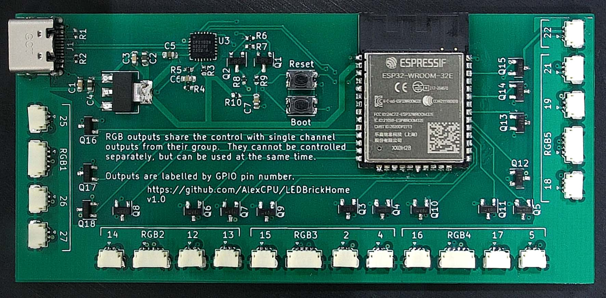
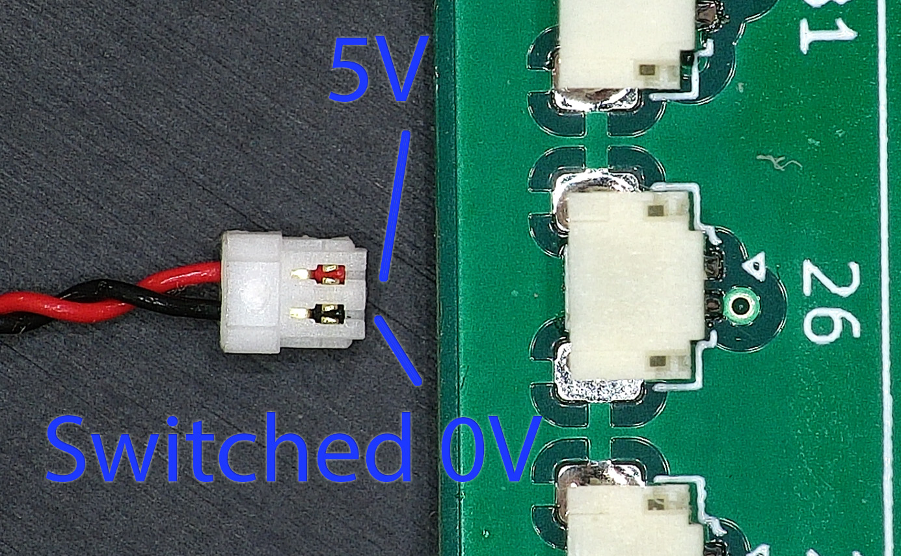
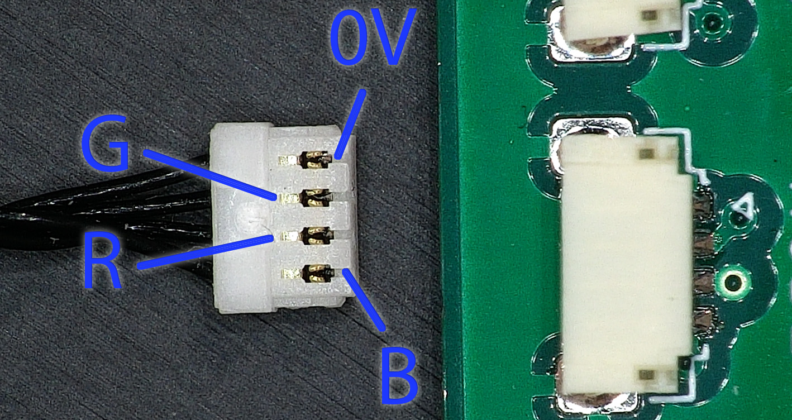

# LEDBrickHome

Wi-Fi controller compatible with various Lego Lighting kits, designed to enable integration of lighting into Home Assistant via ESPHome.  Supports single colour and RGB dimmable lights, lighting effects and use in scenes.

## Versions

Different versions of LEDBrickHome may exist in the future with different numbers of output connectors (e.g. to reduce cost or size).

To maximise available number of channels, RGB (4-pin) outputs are shared with single colour (2-pin) outputs.  In other words, a 16 PWM controller can support a total of 16 different outputs of a single colour, but for each RGB output used, three single colour outputs are lost.

| Version | Total PWM Outputs | 2-pin outputs | 4-pin outputs | Dimensions |
| --- | --- | --- | --- | --- |
| 16ch-v1.0 | 16 | 16 | 5 | 96 x 45 mm |
| 16ch-v1.1 | 16 | 16 | 5 | 68 x 45 mm |

### 16ch-v1

16ch-v1 is based on an ESP32-WROOM (exact memory size does not matter), uses a CP2102N ([drivers](https://www.silabs.com/developers/usb-to-uart-bridge-vcp-drivers?tab=downloads)) for it's USB->UART bridge, and is powered by a USB-C connector.  Outputs are grouped in blocks and identified on the silkscreen which 2-pin outputs are shared with 4-pin outputs.

### 16ch-v1.1

16ch-v1.1 is a smaller version of the previous 16ch design, using a CH340C ([drivers](http://www.wch-ic.com/downloads/CH341SER_ZIP.html)) for it's USB->UART bridge, but is otherwise functionally identical.

## Effects
Various effects are available in ESPHome, which are explained in the [documentation](https://esphome.io/components/light/index.html#light-effects), some of these are included in the code examples already.  For flickering torch effects, the default flicker intensity (of 1.5%) will want to be increased.  The demo video above has flicker set at 10%.

## Compatability

LEDBrickHome is compatible with lighting kits that use a JST SUR connector with 5V on pin 1, and switched 0V on pin 2 (plus pins 3 & 4 for RGB connectors).

Note, order of Red, Green and Blue channels is not important and can be changed in your configuration file.

## PCB Design

The PCB design is created in KiCAD V7, and is a simple 2-layer PCB.

## Tips
* Do not add the web server to the code, this seems to cause the ESP32 to reboot regularly.
* Boot and Reset buttons are included, but shouldn't be required for programming
* Original ESP32's are used rather than newer parts (e.g. S3, C3, etc.) as the original parts support 16 PWM outputs, whereas the newer parts only support 8 PWM outputs.
* RGB outputs may need their output channels swapping if the colour mapping is wrong. i.e. if you ask for Red but get Green, change the appropriate lines in your configuration file.